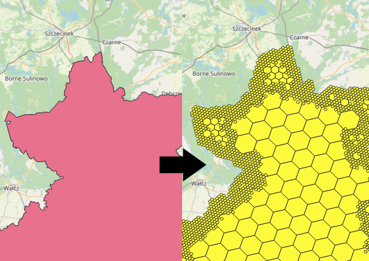

## Locomizer geospatial indexing and format converter utility

To build an artifact, use maven
`mvn clean package`

To get help and examples, invoke from the command line
`java -jar locomizer-geoconv.jar`
